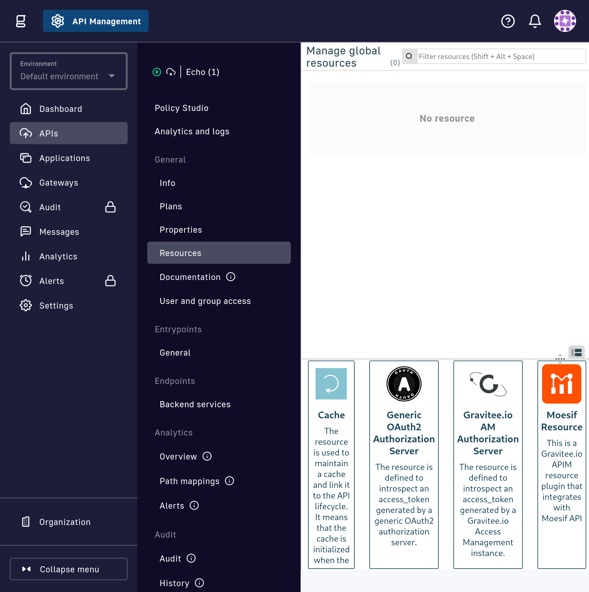
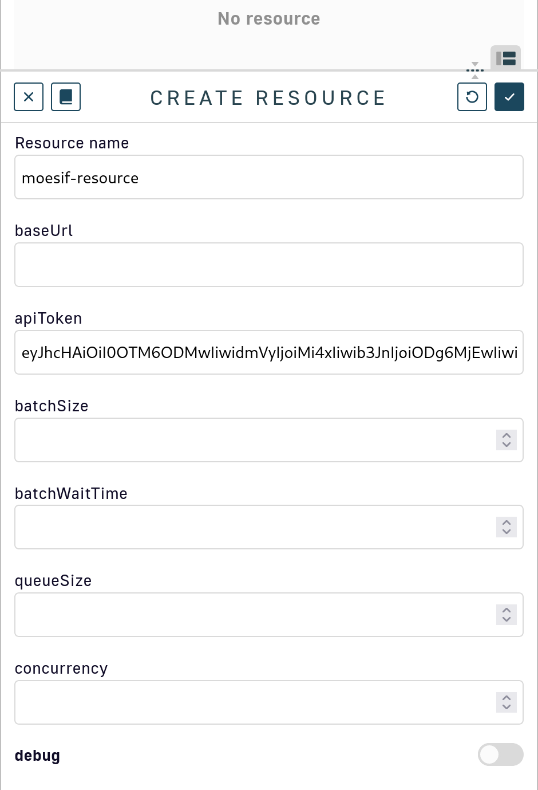
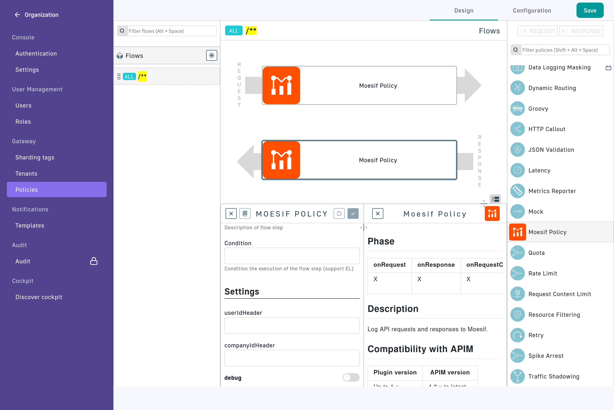

# Gravitee.io - Moesif Integration

This integration enables you to understand customer API usage and monetize your APIs by logging API traffic to Moesif API Monetization and Analytics. With Moesif, you can:

- Analyze customer API usage
- Get alerted of issues
- Monetize APIs with usage-based billing
- Enforce quotas and contract terms
- Guide users with behavioral emails

## How to Install and Configure the Gravitee.io Integration with Moesif

### Step 1: Download the Moesif Plugin packages for Gravitee.io

Download both of the custom plugins required for the integration: [Download Plugin ZIPs](https://github.com/Moesif/moesif-gravitee-plugin/releases)
 - **Moesif Gravitee Policy Plugin**: Captures API event information from HTTP requests and responses. e.g. `moesif-gravitee-policy-1.1.zip`
 - **Moesif Gravitee Resource Plugin**: Sends captured API event data to Moesif for analytics and monitoring with efficient, non-blocking I/O. e.g.  `moesif-gravitee-resource-1.1.zip` 

### Step 2: Install the Resource and Policy

#### Locate the Plugins Directory
- You'll need to add the plugin to the Management API and Gateway Gravitee servers
- The default plugins directory is `${GRAVITEE_HOME}/plugins`, but this can be modified in the `gravitee.yaml` file.
- For example, in the reference installation containers in this repo, the Gateway and Management API plugins folders are located at:
  - `/opt/graviteeio-management-api/plugins`
  - `/opt/graviteeio-gateway/plugins`

You should see the default plugins in these directories already.

#### Upload the Plugins
- Do not unzip the downloaded Policy and Resource plugin ZIP files.
- Ensure that the plugin files remain zipped and are both correctly copied in to the specified `${GRAVITEE_HOME}/plugins` directories of both services.

*Gateway Server*
```
    opt/graviteeio-gateway/plugins/moesif-gravitee-policy-1.1.zip
    opt/graviteeio-gateway/plugins/moesif-gravitee-resource-1.1.zip
```
*Management API Server*
```
    /opt/graviteeio-management-api/plugins/moesif-gravitee-policy-1.1.zip
    /opt/graviteeio-management-api/plugins/moesif-gravitee-resource-1.1.zip
```

 This setup allows the Gravitee APIM to recognize and load the plugins upon restart.


### Step 3: Restart Gravitee

After copying the plugin files, restart the Management API and Gateway services to load the new plugins.

### Step 4: Verify the Installation
1. **Log in to the Gravitee Management Console**:
   - Navigate to the Gravitee Management Console in your web browser.
2. **Check Installed Plugins**:
   - Go to the Plugins section and verify that the Policy and Resource plugins are listed and enabled.

## Configuration

### Step 5: Configure the Resource Plugin
1. **Add the Resource to an API**:
   - Navigate to the API's "Resources" tab in the Gravitee Management Console.
   - You should see the Moesif Resource plugin listed as an available resource. Add it to the API.
   
2. **Configure Resource Settings**:
   - Name the resource `moesif-resource`
   - Set Moesif Application ID (API access token). This is required.
   - Optional settings include:
      - baseUrl (default: Moesif prod "https://api.moesif.net") This is only for development testing and should not be configured for production use.
      - batchSize (default: 100) This is the maximum number of events to send in a batch.
      - batchWaitTime (default: 1000 ms) This is the maximum time to wait before sending a batch of events in milliseconds.
      - queueSize (default: 100000) This is the maximum number of events that can be queued in memory before dropping events.
      - concurrency (default: 1) This will be configurable in the future but is hard-coded to 1 for initial release.
      - debug (default: false) This enables very verbose logging of request and response payloads. This should not be enabled in production.



### Step 6: Configure the Policy Plugin
1. **Add the Policy to an API**:
   - In the Gravitee Management Console, navigate to the Organization -> Policies page.
   - Go to the "Design" tab and add the Policy to the request and response flow for the appropriate flow(s).
2. **Configure Policy Settings**:
   - Set the necessary configuration parameters for the Policy, such as event types to capture, logging levels, and any filters.
   - Configure the `userIdHeader` and `companyIdHeader` fields to specify which request headers to read in order to populate the user and company IDs in the Moesif API event.



## Usage

Once the plugins are installed and configured, they will automatically start capturing and sending API event data to Moesif. You can log in to your Moesif account to view detailed analytics and monitoring data.

## Troubleshooting

### Check Plugin Logs
- Review the Gravitee logs for any errors related to the custom plugins. For enhanced logging, you can enable debug mode in the plugins as well as modify the gravity log configuration to increase the log level for these plugins specifically.  There is an example of this in the reference install [logback.xml](reference-gravitee-install/apim_service_config/logback.xml)

### Verify Configuration
- Ensure Moesif API Application ID is in the resource and that:
    - The Moesif Resource is added to the API.
    - The Moesif Policy is added to the API's request and response flow.
    - The Policy and Resource have been saved and deployed

## Support

For additional support, please contact [Moesif](mailto:team@moesif.com)